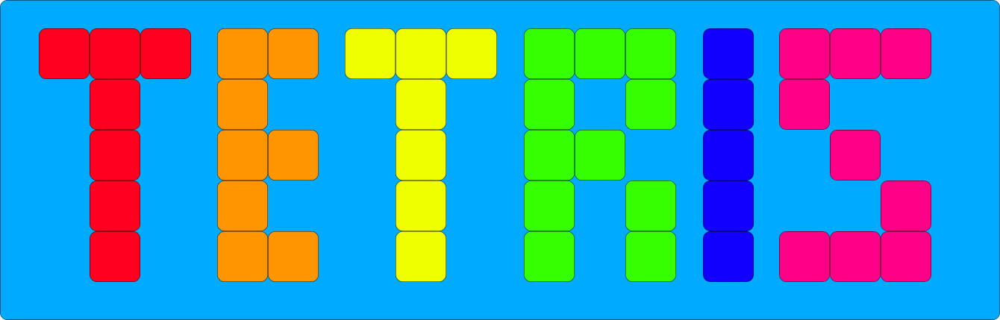
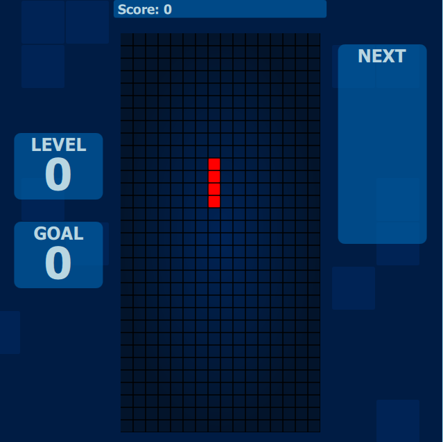
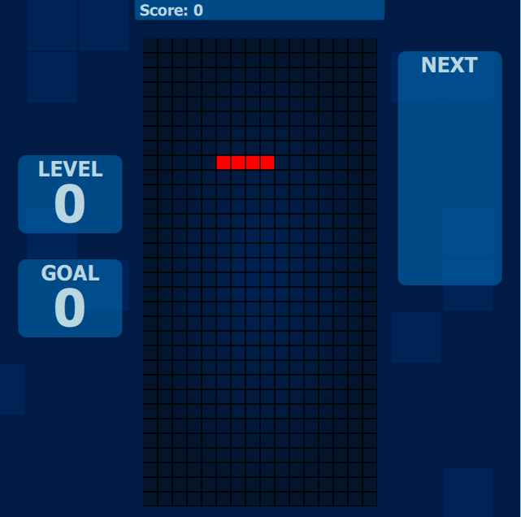
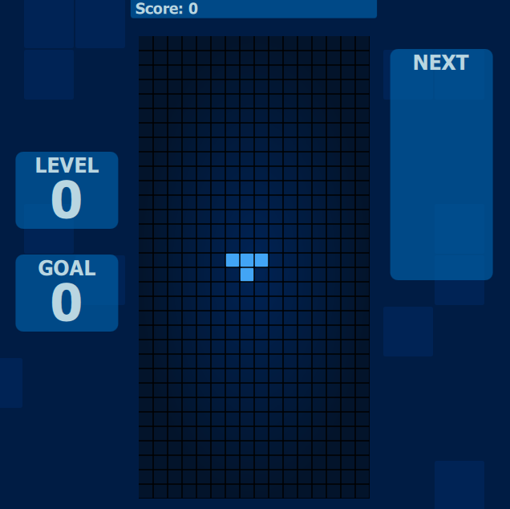

# Tetris

#Description
This project will demonstrate our ability to work as a team on a game using QT creator. The game we have chosen is called Tetris.

The user will use the arrow keys to move falling shapes. The goal of the game is to align the shapes so they create complete horizontal lines along the game play area. When a complete horizontal line is created, it will disappear. Other features will include a game score, a preview of the next shape to fall, a counter for the number of complete lines created, the level of game play, and a speed up feature that will increase the rate at which the shapes fall as the user moves up a game play level.

#Technologies
We will use the Qt Creator IDE for this project and C++ and QML for the languages.

#Screenshots/Mockup

#Installation Instructions
1. Install Qt 5.6  
2. Open project  
3. Clean all, run qmake, build all, run.   

#Contribution Guidelines
Send Documents for review before submitting

#Bugs and TODO List  

Bugs:  
1. Score needs to take into account the time and the number of lines broken at once  
2. Background color shift doesn't reset correctly after starting a new game  
3. scoreboard size of text needs to change based off of screen size.  
TODO list:  
1. splash screen --> done  
2. readme --> continue to update  
3. menu -->done  
4. hud - implement score, goal, level, and next feature --> done  
5. tetris graphics - work on rotate and drop animation --> done  
6. generate tetris objects --> done  
7. rotate tetris objects --> done  
8. drop mechanic --> done  
9. stack mechanic --> done  
10. destroy full line --> done!!! :D 

#Contributor List
Isaac Harries  
Stephanie Vetter 

#Credits, Inspirations, Alternative
Tetris is cool!
--update--
Tetris is LESS cool -.-

#License
MIT

The MIT License is a free software license originating at the Massachusetts Institute of Technology (MIT). It is a permissive free software license, meaning that it puts only very limited restriction on reuse and has therefore an excellent license compatibility. The MIT license permits reuse within proprietary software provided all copies of the licensed software include a copy of the MIT License terms and the copyright notice. The MIT license is also compatible with many copyleft licenses, such as the GPL; MIT licensed software can be integrated into GPL software, but not the other way around.
