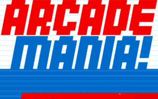
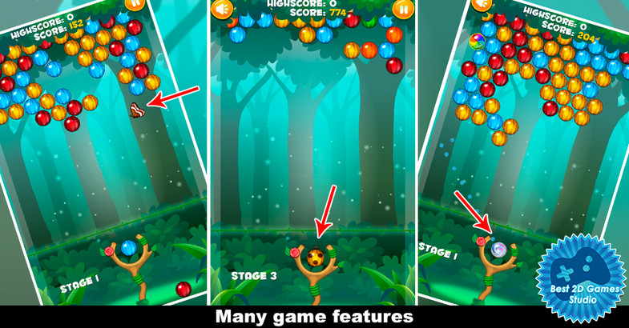

# arcademania

#Description
This project will demonstrate our ability to work as a team on a game using QT creator. The game we have chosen is called Bubble Shooter.
The user can position the pivoting bubble shooter to launch a bubble upwards. The bubble will hit a mass of bubbles above. If the projectile 
hits a group of (3 or more) bubbles of the same color, they will pop. If the basic features of the game are completed before the end of the
term, we will add a scoreboard feature and the ability for the celing to drop closer to the bubble shooter, and an infinity mode in which
endless bubbles are populated from above.

#Technologies
We will use the Qt Creator IDE for this project and C++ and QML for the languages.

#Screenshots/Mockup

#Installation Instructions
1. Install Qt 5.6 
2. Open project 
3. Clean all, run qmake, build all, run. 

#Contribution Guidelines

#Bugs and TODO List

#Contributor List
Isaac Harries<n/>
Stephanie Vetter

#Credits, Inspirations, Alternative
I like bubbles.

#License
MIT
