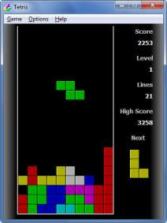

# arcademania

#Description
This project will demonstrate our ability to work as a team on a game using QT creator. The game we have chosen is called Tetris.

The user will use the arrow keys to move falling shapes. The goal of the game is to align the shapes so they create complete horizontal lines along the game play area. When a complete horizontal line is created, it will disappear. Other features will include a game score, a preview of the next shape to fall, a counter for the number of complete lines created, the level of game play, and a speed up feature that will increase the rate at which the shapes fall as the user moves up a game play level.

#Technologies
We will use the Qt Creator IDE for this project and C++ and QML for the languages.

#Screenshots/Mockup

#Installation Instructions
1. Install Qt 5.6 
2. Open project 
3. Clean all, run qmake, build all, run. 

#Contribution Guidelines

#Bugs and TODO List

#Contributor List
Isaac Harries,
Stephanie Vetter

#Credits, Inspirations, Alternative
Tetris is cool!

#License
MIT
